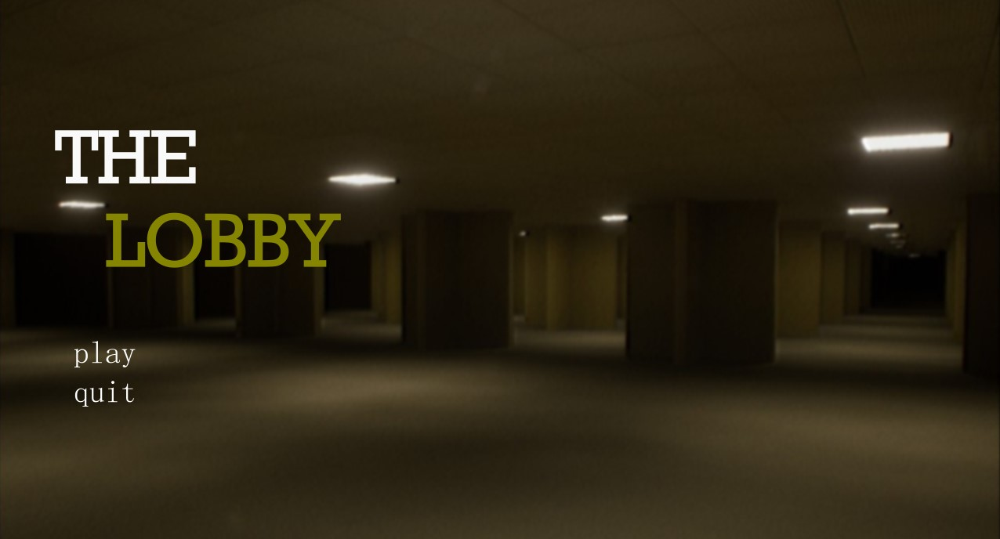
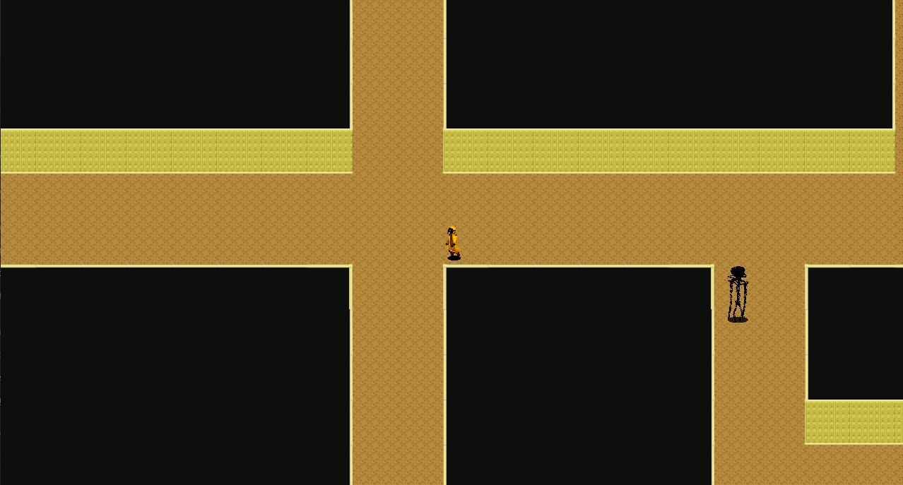

# 🚀 Nome do Projeto

The Lobby é um jogo 2D em estilo 8bits, com visão top-down, onde o jogador precisa reparar 6 caixas de fusíveis em um ambiente labiríntico inspirado nas Backrooms. O inimigo, a Bacteria, busca o jogador utilizando o algoritmo BFS. O objetivo é escapar após reparar os fusíveis, fugindo através de uma porta. 

---

## 🎯 Objetivo

O projeto visa criar uma experiência imersiva onde o jogador precisa resolver desafios e se esquivar de inimigos em um ambiente misterioso. A motivação do jogo é proporcionar uma jogabilidade tensa, combinando exploração e estratégia, onde o uso de algoritmos de busco em grafos (BFS) é essencial para a movimentação do inimigo. O jogo também demonstra como algoritmos podem ser aplicados em jogos 2D para interação de IA.
---

## 👨‍💻 Tecnologias e Softwares Utilizadas

- Python 3.13
- Pygame
- BFS (Busca em Largura)
- IDE Pycharm
- Piskel
- Inkscape

---

## 🗂️ Estrutura do Projeto
```
📦 TheLobby
├── 📁.idea
├── 📁assets
├── 📁scripts
│   ├── startgame.py
│   ├── player.py
│   ├── enemy.py
│   ├── obj.py
│   ├── menu.py
│   ├── gameover.py
│   ├── endgame.py
│   ├── scene.py
│   ├── settings.py
│   ├── text.py
│   ├── ...
├── main.py
├── README.md
└── requirements.txt
```

---

## ⚙️ Como Executar

### ✅ Rodando Localmente

1. Clone o repositório:

```
git clone https://github.com/NicolasSkopek/TheLobby
cd TheLobby
```

2. Crie o ambiente virtual e ative:

```
python -m venv venv
source venv/bin/activate  # ou venv\Scripts\activate no Windows
```

3. Instale as dependências:

```
pip install -r requirements.txt
```

4. Execute a aplicação:

```
python main.py
```

---

## 📸 Demonstrações





---

## 👥 Equipe

| Nome                         | GitHub |
|------------------------------|--------|
| Nicolas Skopek de Lima       | [@NicolasSkopek](https://github.com/ryanjuvenal) |
| Ryan Juvenal Santos Oliveira | [@ryanjuvenal](https://github.com/NicolasSkopek) |

---

## 🧠 Disciplinas Envolvidas

- Estrutura de Dados I
- Teoria dos Grafos
- Linguagens Formais e Autômatos

---

## 🏫 Informações Acadêmicas

- Universidade: **Universidade Braz Cubas**
- Curso: **Ciência da Computação**
- Semestre: 5º
- Período: Noite
- Professora orientadora: **Dra. Andréa Ono Sakai**
- Evento: **Mostra de Tecnologia 1º Semestre de 2025**
- Local: Laboratório 12
- Datas: 05 e 06 de junho de 2025

---

## 📄 Licença

MIT License — sinta-se à vontade para utilizar, estudar e adaptar este projeto.
